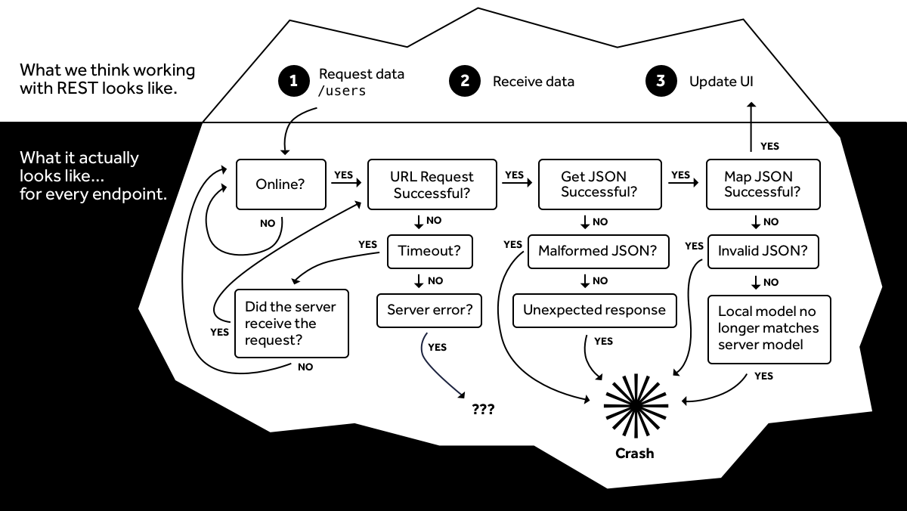

# REST in Peace

---

# WHOAMI

<ul>
    <li>Herman Slatman</li>
  <li>
    Studied at University of Twente
    <ul>
      <li>BSc. Technische Informatica</li>
      <li>MSC. Computer Science (Kerckhoff's Institute)</li>
    </ul>
  </li>
  <li>
    Currently a Software Architect at Extendas
    <ul>
        <li>Since August 2016</li>
    	<li>Backend (PHP, Python)</li>
  	    <li>Mobile (Swift)</li>
    </ul>
  </li>
  <li>
    Contact information @ <a target="_blank" href="https://hermanslatman.nl/contact.html">https://hermanslatman.nl/contact.html</a>
  </li>
</ul>

---

# Introduction

<ul>
    <li>
        Mobile app development basics
    </li>
    <li>
        Frustrations in mobile app development
    </li>
    <li>
        Fast tracking app development with RMP
    </li>
    <li>
        Demo
    </li>
</ul>

---

# Components of a mobile app

<ul>
    <li>
        User Interface
        <ul>
            <li>Defines what users see</li>
            <li>Allows users to interact with the app</li>
        </ul>
    </li>
    <li>
        Business Logic
        <ul>
            <li>Models the domain of the application</li>
            <li>Defines the functionality of your app</li>
        </ul>
    </li>
    <li>
        Storage
        <ul>
    	    <li>Remember stuff</li>
    	    <li>Can basically be anything</li>
        </ul>
    </li>
    <li>
        Networking
        <ul>
            <li>Interact with web services</li>
            <li>Retrieve and send data</li>
            <li>An online backend</li>
        </ul>
    </li>
    <li>
        Hardware
    </li>
    <li>
        Diagnostics &amp; Logging
    </li>
</ul>


+++

# Today:

<ul>
    <li class="greyed">
        User Interface
        <ul>
            <li>Defines what users see</li>
            <li>Allows users to interact with the app</li>
        </ul>
    </li>
    <li class="greyed">
        Business Logic
        <ul>
            <li>Models the domain of the application</li>
            <li>Defines the functionality of your app</li>
        </ul>
    </li>
    <li>
        Storage
        <ul>
    	    <li>Remember stuff</li>
    	    <li>Can basically be anything</li>
        </ul>
    </li>
    <li>
        Networking
        <ul>
            <li>Interact with web services</li>
            <li>Retrieve and send data</li>
            <li>An online backend</li>
        </ul>
    </li>
    <li class="greyed">
        Hardware
    </li>
    <li class="greyed">
        Diagnostics &amp; Logging
    </li>
</ul>


---


# Storage

<ul>
    <li>
        Store data for repeated usage
    </li>
    <li>
        Some storage options:
        <ul>
            <li>Shared preferences</li>
            <li>Files</li>
            <li>Database</li>
            <li>Online data storage providers</li>
        </ul>
    </li>
    <li class="fragment">
        Databases provide ways to:
        <ul>
            <li>Efficiently store (new) data</li>
            <li>Link data records to each other</li>
            <li>Query the data</li>
            <li>Change existing data</li>
        </ul>
    </li>
    <li class="fragment">
        SQLite is a popular database for mobile devices
    </li>
</ul>


+++


# Example SQLite usage (crash course)

``` 

// SOURCE: http://hmkcode.com/android-simple-sqlite-database-tutorial/

public class Book {

	private int id;
	private String title;
	private String author;

	public Book(){}

	public Book(String title, String author) {
		super();
		this.title = title;
		this.author = author;
	}

	//getters & setters

	@Override
	public String toString() {
		return "Book [id=" + id + ", title=" + title + ", author=" + author
				+ "]";
	}
}


public class MySQLiteHelper extends SQLiteOpenHelper {
	
	// Database Version
	private static final int DATABASE_VERSION = 1;
	// Database Name
	private static final String DATABASE_NAME = "BookDB";

	public MySQLiteHelper(Context context) {
		super(context, DATABASE_NAME, null, DATABASE_VERSION);	
	}

	@Override
	public void onCreate(SQLiteDatabase db) {
		// SQL statement to create book table
		String CREATE_BOOK_TABLE = "CREATE TABLE books ( " +
				"id INTEGER PRIMARY KEY AUTOINCREMENT, " + 
				"title TEXT, "+
				"author TEXT )";

		// create books table
		db.execSQL(CREATE_BOOK_TABLE);
	}

	@Override
	public void onUpgrade(SQLiteDatabase db, int oldVersion, int newVersion) {
		// Drop older books table if existed
		db.execSQL("DROP TABLE IF EXISTS books");

		// create fresh books table
		this.onCreate(db);
	}
	//---------------------------------------------------------------------

	/**
	 * CRUD operations (create "add", read "get", update, delete) book + get all books + delete all books
	 */

	// Books table name
	private static final String TABLE_BOOKS = "books";

	// Books Table Columns names
	private static final String KEY_ID = "id";
	private static final String KEY_TITLE = "title";
	private static final String KEY_AUTHOR = "author";

	private static final String[] COLUMNS = {KEY_ID,KEY_TITLE,KEY_AUTHOR};

	public void addBook(Book book){
		Log.d("addBook", book.toString());
		// 1. get reference to writable DB
		SQLiteDatabase db = this.getWritableDatabase();

		// 2. create ContentValues to add key "column"/value
		ContentValues values = new ContentValues();
		values.put(KEY_TITLE, book.getTitle()); // get title 
		values.put(KEY_AUTHOR, book.getAuthor()); // get author

		// 3. insert
		db.insert(TABLE_BOOKS, // table
				null, //nullColumnHack
				values); // key/value -> keys = column names/ values = column values

		// 4. close
		db.close(); 
	}

	public Book getBook(int id){

		// 1. get reference to readable DB
		SQLiteDatabase db = this.getReadableDatabase();

		// 2. build query
		Cursor cursor = 
				db.query(TABLE_BOOKS, // a. table
				COLUMNS, // b. column names
				" id = ?", // c. selections 
				new String[] { String.valueOf(id) }, // d. selections args
				null, // e. group by
				null, // f. having
				null, // g. order by
				null); // h. limit

		// 3. if we got results get the first one
		if (cursor != null)
			cursor.moveToFirst();

		// 4. build book object
		Book book = new Book();
		book.setId(Integer.parseInt(cursor.getString(0)));
		book.setTitle(cursor.getString(1));
		book.setAuthor(cursor.getString(2));

		Log.d("getBook("+id+")", book.toString());

		// 5. return book
		return book;
	}

	// Get All Books
	public List<Book> getAllBooks() {
		List<Book> books = new LinkedList<Book>();

		// 1. build the query
		String query = "SELECT * FROM " + TABLE_BOOKS;

		// 2. get reference to writable DB
		SQLiteDatabase db = this.getWritableDatabase();
		Cursor cursor = db.rawQuery(query, null);

		// 3. go over each row, build book and add it to list
		Book book = null;
		if (cursor.moveToFirst()) {
			do {
				book = new Book();
				book.setId(Integer.parseInt(cursor.getString(0)));
				book.setTitle(cursor.getString(1));
				book.setAuthor(cursor.getString(2));

				// Add book to books
				books.add(book);
			} while (cursor.moveToNext());
		}

		Log.d("getAllBooks()", books.toString());

		// return books
		return books;
	}

	 // Updating single book
	public int updateBook(Book book) {

		// 1. get reference to writable DB
		SQLiteDatabase db = this.getWritableDatabase();

		// 2. create ContentValues to add key "column"/value
		ContentValues values = new ContentValues();
		values.put("title", book.getTitle()); // get title 
		values.put("author", book.getAuthor()); // get author

		// 3. updating row
		int i = db.update(TABLE_BOOKS, //table
				values, // column/value
				KEY_ID+" = ?", // selections
				new String[] { String.valueOf(book.getId()) }); //selection args

		// 4. close
		db.close();

		return i;

	}

	// Deleting single book
	public void deleteBook(Book book) {

		// 1. get reference to writable DB
		SQLiteDatabase db = this.getWritableDatabase();

		// 2. delete
		db.delete(TABLE_BOOKS,
				KEY_ID+" = ?",
				new String[] { String.valueOf(book.getId()) });

		// 3. close
		db.close();

		Log.d("deleteBook", book.toString());

	}
}


public class MainActivity extends Activity {

	@Override
	protected void onCreate(Bundle savedInstanceState) {
		super.onCreate(savedInstanceState);
		setContentView(R.layout.activity_main);

		MySQLiteHelper db = new MySQLiteHelper(this);

		/**
		 * CRUD Operations
		 * */
		// add Books
		db.addBook(new Book("Android Application Development Cookbook", "Wei Meng Lee"));   
		db.addBook(new Book("Android Programming: The Big Nerd Ranch Guide", "Bill Phillips and Brian Hardy"));       
		db.addBook(new Book("Learn Android App Development", "Wallace Jackson"));

		// get all books
		List<Book> list = db.getAllBooks();

		// delete one book
		db.deleteBook(list.get(0));

		// get all books
		db.getAllBooks();

	}
}


```

Note:
SQLite is a software library that implements a self-contained, serverless, zero-configuration, transactional SQL database engine.

SQLite is relatively small, simple to embed, has an embedded engine, provides broad SQL support, storage file is cross-platform, 


---

# Networking

<ul>
    <li>
        Many apps rely on external systems
        <ul>
            <li>Retrieve information about the weather</li>
            <li>Post messages to friends</li>
        </ul>
    </li>
    <li class="fragment">
        External systems can be reached via a network, such as the internet
        <ul>
            <li>But how can we communicate with them?</li>
        </ul>
    </li>
    <li class="fragment">
        REST(ful) APIs are common
    </li>
    <li class="fragment">
        Others include:
        <ul>
            <li>SOAP (XML), which is old, but still around</li>
            <li><a target="_blank" href="https://grpc.io/">gRPC</a>, an open source RPC framework</li>
            <li><a target="_blank" href="https://grpc.io/">GraphQL</a>, which allows you to easily query multiple APIs</li>
        </ul>
    </li>
</ul>


+++

# Example RESTful API


---


# All seems well...

## ... but there may be trouble ahead

<ul>
    <li class="fragment">
        Storage
        <ul>
            <li>Maintaining database schemas can become hard or a lot of work</li>
            <li>Lots of boilerplate code for storage and retrieval</li>
        </ul>
    </li>
    <li class="fragment">
        Networking
        <ul>
            <li>Network can fail in many ways</li>
            <li>Lots of boilerplate code for communicating with APIs</li>
            <li>No built-in validation of data from APIs</li>
        </ul>
    </li>
</ul>


+++



---

# Can we make this easier?

+++

# Partial solutions

<ul>
    <li>
        Storage
        <ul>
            <li>Use an ORM, like <a target="_blank" href="https://github.com/greenrobot/greenDAO">greenDAO</a></li>
            <li>Use a realtime, online database with local persistence, like <a target="_blank" href="https://firebase.google.com/docs/database/">Firebase</a>
            <li>Use a different type of local database, like <a target="_blank" href="http://objectbox.io/">ObjectBox</a>
        </ul>
    </li>
    <li>
        Networking
        <ul>
            <li>Handle (large) images with <a target="_blank" href="http://square.github.io/picasso/">Picasso</a>
            <li>Improve handling JSON using <a target="_blank" href="https://github.com/FasterXML/jackson">Jackson</a> or <a target="_blank" href="https://github.com/square/moshi">Moshi</a></li>
            <li>Automatically map RESTful API endpoints (and error handling!) with <a target="_blank" href="http://square.github.io/retrofit/">Retrofit</a>
        </ul>
    </li>
</ul>


+++


# Can we make it even easier?

Note:
Al deze deeloplossingen kunnen bijdragen aan het verbeteren van je app. 
Toch zijn er nog steeds zaken die je er nog niet mee afhandelt, zoals volledige synchronisatie van gegevens of het ontvangen van veranderingen in realtime.

Bij Extendas hebben we gezocht naar een (totaal)oplossing voor data opslag voor objecten, realtime synchronisatie en de mogelijkheid om de interface automatisch te updaten wanneer nodig.
Daarbij zijn we uitgekomen op het Realm Mobile Platform.

+++


# Realm Mobile Platform

<ul>
    <li>
        Realm Mobile Database
        <ul>
            <li>Queries are <a target="_blank" href="https://github.com/realm/realm-java-benchmarks">super fast</a>*</li>
            <li>Object definitions become simple and define the schema</li>
            <li>Changes to data <b><i>can</i></b> update the user interface (almost) instantly</li>
            <li>Takes less space to store the same kind of data (in general)</li>
            <li>Cross-platform: Android, iOS, Xamarin, React Native, Node.js, .Net Core</li>
        </ul>
    </li>
    <li>
        Realm Object Server
        <ul>
            <li>Synchronizes the local database with an online one</li>
            <li>Handles conflict resolution and network state</li>
            <li>Allows multiple users to read and/or write in each others realms (when configured)</li>
            <li>Provides functions to be executed on data changes (currently you get 3 for free)</li>
        </ul>
    </li>
</ul>

<h6>*Keep in mind that benchmarks are hard</h6>

<h6>Also check <a target="_blank" href="https://www.slideshare.net/ChristianMelchior/realm-building-a-mobile-database">this presentation</a> for more info on Realm internals</h6>

---

# Demo

<ul>
    <li>Some example Android code</li>
    <li>Realm Object Server backend</li>
    <li>Example application</li>
</ul>

+++


# Demo: Realm Tasks


+++

## User Registration

```

... Omitted some imports

public class RegisterActivity extends AppCompatActivity implements SyncUser.Callback {

    private AutoCompleteTextView usernameView;
    private EditText passwordView;
    private EditText passwordConfirmationView;
    private View progressView;
    private View registerFormView;
    private FacebookAuth facebookAuth;
    private GoogleAuth googleAuth;

    @Override
    protected void onCreate(Bundle savedInstanceState) {
        super.onCreate(savedInstanceState);
        setContentView(R.layout.activity_register);
        usernameView = (AutoCompleteTextView) findViewById(R.id.username);
        passwordView = (EditText) findViewById(R.id.password);
        passwordConfirmationView = (EditText) findViewById(R.id.password_confirmation);

        final Button mailRegisterButton = (Button) findViewById(R.id.email_register_button);
        mailRegisterButton.setOnClickListener(new View.OnClickListener() {
            @Override
            public void onClick(View view) {
                attemptRegister();
            }
        });

        registerFormView = findViewById(R.id.register_form);
        progressView = findViewById(R.id.register_progress);

        // Setup Facebook Authentication
        facebookAuth = new FacebookAuth((LoginButton) findViewById(R.id.login_button)) {
            @Override
            public void onRegistrationComplete(final LoginResult loginResult) {
                UserManager.setAuthMode(UserManager.AUTH_MODE.FACEBOOK);
                SyncCredentials credentials = SyncCredentials.facebook(loginResult.getAccessToken().getToken());
                SyncUser.loginAsync(credentials, AUTH_URL, RegisterActivity.this);
            }
        };

        // Setup Google Authentication
        googleAuth = new GoogleAuth((SignInButton) findViewById(R.id.sign_in_button), this) {
            @Override
            public void onRegistrationComplete(GoogleSignInResult result) {
                UserManager.setAuthMode(UserManager.AUTH_MODE.GOOGLE);
                GoogleSignInAccount acct = result.getSignInAccount();
                SyncCredentials credentials = SyncCredentials.google(acct.getIdToken());
                SyncUser.loginAsync(credentials, AUTH_URL, RegisterActivity.this);
            }
        };
    }

    @Override
    protected void onActivityResult(int requestCode, int resultCode, Intent data) {
        googleAuth.onActivityResult(requestCode, resultCode, data);
        facebookAuth.onActivityResult(requestCode, resultCode, data);
    }

    private void attemptRegister() {
        
        // Error checking on input fields omitted
        ...
        
        
        if (cancel) {
            focusView.requestFocus();
        } else {
            showProgress(true);
            SyncUser.loginAsync(SyncCredentials.usernamePassword(username, password, true), AUTH_URL, new SyncUser.Callback() {
                @Override
                public void onSuccess(SyncUser user) {
                    registrationComplete(user);
                }

                @Override
                public void onError(ObjectServerError error) {
                    showProgress(false);
                    String errorMsg;
                    switch (error.getErrorCode()) {
                        case EXISTING_ACCOUNT: errorMsg = "Account already exists"; break;
                        default:
                            errorMsg = error.toString();
                    }
                    Toast.makeText(RegisterActivity.this, errorMsg, Toast.LENGTH_LONG).show();
                }
            });
        }
    }

    private void registrationComplete(SyncUser user) {
        UserManager.setActiveUser(user);
        Intent intent = new Intent(this, SignInActivity.class);
        intent.addFlags(Intent.FLAG_ACTIVITY_CLEAR_TOP);
        startActivity(intent);
    }

}

```

+++

## User Management

```

... Removed some imports

public class UserManager {
    // Supported authentication mode
    public enum AUTH_MODE {
        PASSWORD,
        FACEBOOK,
        GOOGLE
    }
    private static AUTH_MODE mode = AUTH_MODE.PASSWORD; // default

    public static void setAuthMode(AUTH_MODE m) {
        mode = m;
    }

    public static void logoutActiveUser() {
        switch (mode) {
            case PASSWORD: {
                // Do nothing, handled by the `User.currentUser().logout();`
                break;
            }
            case FACEBOOK: {
                LoginManager.getInstance().logOut();
                break;
            }
            case GOOGLE: {
                // the connection is handled by `enableAutoManage` mode
                break;
            }
        }
        SyncUser.currentUser().logout();
    }

    // Configure Realm for the current active user
    public static void setActiveUser(SyncUser user) {
        SyncConfiguration defaultConfig = new SyncConfiguration.Builder(user, RealmTasksApplication.REALM_URL).build();
        Realm.setDefaultConfiguration(defaultConfig);
    }
}

```

+++

## User Login


```

... Removed quite a number of imports

public class SignInActivity extends AppCompatActivity implements SyncUser.Callback {

    public static final String ACTION_IGNORE_CURRENT_USER = "action.ignoreCurrentUser";

    private AutoCompleteTextView usernameView;
    private EditText passwordView;
    private View progressView;
    private View loginFormView;
    private FacebookAuth facebookAuth;
    private GoogleAuth googleAuth;

    @Override
    protected void onCreate(Bundle savedInstanceState) {
        
        // Quite similar to the RegisterActivity.onCreate
        ...
        
    }

    @Override
    public void onSuccess(SyncUser user) {
        showProgress(false);
        loginComplete(user);
    }

    private void loginComplete(SyncUser user) {
        UserManager.setActiveUser(user);

        createInitialDataIfNeeded();

        Intent listActivity = new Intent(this, TaskListActivity.class);
        Intent tasksActivity = new Intent(this, TaskActivity.class);
        tasksActivity.putExtra(TaskActivity.EXTRA_LIST_ID, RealmTasksApplication.DEFAULT_LIST_ID);
        startActivities(new Intent[] { listActivity, tasksActivity} );
        finish();
    }

    private static void createInitialDataIfNeeded() {
        final Realm realm = Realm.getDefaultInstance();
        //noinspection TryFinallyCanBeTryWithResources
        try {
            if (realm.where(TaskListList.class).count() != 0) {
                return;
            }
            realm.executeTransaction(new Realm.Transaction() {
                @Override
                public void execute(Realm realm) {
                    if (realm.where(TaskListList.class).count() == 0) {
                        final TaskListList taskListList = realm.createObject(TaskListList.class, 0);
                        final TaskList taskList = new TaskList();
                        taskList.setId(RealmTasksApplication.DEFAULT_LIST_ID);
                        taskList.setText(RealmTasksApplication.DEFAULT_LIST_NAME);
                        taskListList.getItems().add(taskList);
                    }
                }
            });
        } finally {
            realm.close();
        }
    }
}

```

+++

## Showing and updating data

``` 

... Removed some imports

public class TaskActivity extends AppCompatActivity {

	public static final String EXTRA_LIST_ID = "extra.list_id";

	private Realm realm;
	private RecyclerViewWithEmptyViewSupport recyclerView;
	private TaskAdapter adapter;
	private TouchHelper touchHelper;
	private String id;
	RealmResults<TaskList> list;
	private boolean logoutAfterClose;
	
	... Some code omitted for brevity

	@Override
	protected void onStart() {
		super.onStart();
		if (touchHelper != null) {
			touchHelper.attachToRecyclerView(null);
		}
		adapter = null;
		realm = Realm.getDefaultInstance();
		list = realm.where(TaskList.class).equalTo(TaskList.FIELD_ID, id).findAll();
		list.addChangeListener(new RealmChangeListener<RealmResults<TaskList>>() {
			@Override
			public void onChange(RealmResults<TaskList> results) {
				updateList(results);
			}
		});
		updateList(list);
	}

	private void updateList(RealmResults<TaskList> results) {
		// Use `findAllAsync` because change listeners are not called when items are deleted and using `findFirst()`
		// See https://github.com/realm/realm-java/issues/3138
		if (results.size() > 0) {
			TaskList element = results.first();
			setTitle(element.getText());
			if (adapter == null) {
				adapter = new TaskAdapter(TaskActivity.this, element.getItems());
				touchHelper = new TouchHelper(new Callback(), adapter);
				touchHelper.attachToRecyclerView(recyclerView);
			}
		} else {
			setTitle(getString(R.string.title_deleted));
		}
	}

	@Override
	protected void onStop() {
		if (adapter != null) {
			touchHelper.attachToRecyclerView(null);
			adapter = null;
		}
		realm.removeAllChangeListeners();
		realm.close();
		realm = null;
		if (logoutAfterClose) {
			/*
			 * We need call logout() here since onCreate() of the next Activity is already
			 * executed before reaching here.
			 */
			UserManager.logoutActiveUser();
			logoutAfterClose = false;
		}

		super.onStop();
	}

	private class Callback implements TouchHelper.Callback {

		@Override
		public void onMoved(RecyclerView recyclerView, ItemViewHolder from, ItemViewHolder to) {
			final int fromPosition = from.getAdapterPosition();
			final int toPosition = to.getAdapterPosition();
			adapter.onItemMoved(fromPosition, toPosition);
			adapter.notifyItemMoved(fromPosition, toPosition);
		}

		@Override
		public void onCompleted(ItemViewHolder viewHolder) {
			adapter.onItemCompleted(viewHolder.getAdapterPosition());
			adapter.notifyDataSetChanged();
		}

		@Override
		public void onDismissed(ItemViewHolder viewHolder) {
			final int position = viewHolder.getAdapterPosition();
			adapter.onItemDismissed(position);
			adapter.notifyItemRemoved(position);
		}

		@Override
		public void onChanged(ItemViewHolder viewHolder) {
			adapter.onItemChanged(viewHolder);
			adapter.notifyItemChanged(viewHolder.getAdapterPosition());
		}

		@Override
		public void onAdded() {
			adapter.onItemAdded();
			adapter.notifyItemInserted(0);
		}

		@Override
		public void onReverted(boolean shouldUpdateUI) {
			adapter.onItemReverted();
			if (shouldUpdateUI) {
				adapter.notifyDataSetChanged();
			}
		}
	}
}


public class TaskAdapter extends CommonAdapter<Task> implements TouchHelperAdapter {

	public TaskAdapter(Context context, OrderedRealmCollection<Task> items) {
		super(context, items);
	}

	@Override
	public void onBindViewHolder(RecyclerView.ViewHolder holder, int position) {
		super.onBindViewHolder(holder, position);

        ... Code omitted for brevity
	}

	@Override
	public void onItemAdded() {
		final Realm realm = Realm.getDefaultInstance();
		realm.executeTransaction(new Realm.Transaction() {
			@Override
			public void execute(Realm realm) {
				// TaskList might have been deleted, in that case, don't create any new.
				if (getData().isValid()) {
					final Task task = realm.createObject(Task.class);
					task.setText("");
					getData().add(0, task);
				}
			}
		});
		realm.close();
	}

	@Override
	public void onItemMoved(final int fromPosition, final int toPosition) {
		final Realm realm = Realm.getDefaultInstance();
		realm.executeTransaction(new Realm.Transaction() {
			@Override
			public void execute(Realm realm) {
				moveItems(fromPosition, toPosition);
			}
		});
		realm.close();
	}

	@Override
	public void onItemCompleted(final int position) {
		final Task task = getData().get(position);
		final Realm realm = Realm.getDefaultInstance();
		final int count = (int) getData().where().equalTo(Task.FIELD_COMPLETED, false).count();
		realm.executeTransaction(new Realm.Transaction() {
			@Override
			public void execute(Realm realm) {
				if (!task.isCompleted()) {
					task.setCompleted(true);
					moveItems(position, count - 1);
				} else {
					task.setCompleted(false);
					moveItems(position, count);
				}
			}
		});
		realm.close();
	}

	@Override
	public void onItemDismissed(final int position) {
		final Realm realm = Realm.getDefaultInstance();
		realm.executeTransaction(new Realm.Transaction() {
			@Override
			public void execute(Realm realm) {
				final Task task = getData().get(position);
				task.deleteFromRealm();
			}
		});
		realm.close();
	}

	@Override
	public void onItemReverted() {
		if (getData().size() == 0) {
			return;
		}
		final Realm realm = Realm.getDefaultInstance();
		realm.executeTransaction(new Realm.Transaction() {
			@Override
			public void execute(Realm realm) {
				final Task task = getData().get(0);
				task.deleteFromRealm();
			}
		});
		realm.close();
	}

	@Override
	public void onItemChanged(final ItemViewHolder viewHolder) {
		final Realm realm = Realm.getDefaultInstance();
		final int position = viewHolder.getAdapterPosition();
		if (position < 0) {
			realm.close();
			return;
		}
		realm.executeTransaction(new Realm.Transaction() {
			@Override
			public void execute(Realm realm) {
				Task task = getData().get(position);
				task.setText(viewHolder.getText().getText().toString());
				task.setDate(null); // remove date on text change, server will set
									// new value if there is a value to be set.
			}
		});
		realm.close();
	}
}


```


+++

# Demo: Realm Object Server

Realm Object Server Developer Edition is free* to use!

Paid options are available for more functions.

<a target="_blank" href="http://ros-test.spinpos.com:9080/">Realm Object Server</a>

<h6>*Free as in free beer</h6>


+++


# Demo: Realm Tasks

<ul>
    <li>Running within iOS emulator</li>
    <li>Synchronized with the Realm Object Server</li>
    <li>Available at <a target="_blank" href="https://github.com/realm-demos/realm-tasks">GitHub</a></li>
</ul>


+++

# Demo: Realm Draw

<ul>
    <li>Real-time sharing of drawings</li>
    <li>Android and iOS can draw together</li>
    <li>Available at <a target="_blank" href="https://github.com/realm-demos/realm-draw">GitHub</a></li>
</ul>

+++?image=http://i.giphy.com/90F8aUepslB84.gif


# Such Wow!


---

# (Additional) Resources

<ul>
    <li><a href="https://realm.io/products/realm-mobile-platform/" target="_blank">Realm Mobile Platform</a></li>
    <li><a href="https://github.com/realm/realm-java/tree/master/examples" target="_blank">Realm Examples</a></li>
    <li><a href="https://github.com/realm-demos" target="_blank">Realm Demos</a></li>
    <li><a href="https://www.extendas.com" target="_blank">Extendas</a></li>
    <li><a href="https://www.extendas.com/corporate/vacatures/" target="_blank">Vacatures</a></li>
    <li>(Meeloop)stages en afstudeeropdrachten: <a href="mailto:herman@extendas.com" target="_blank">herman@extendas.com</a></li>
</ul>


