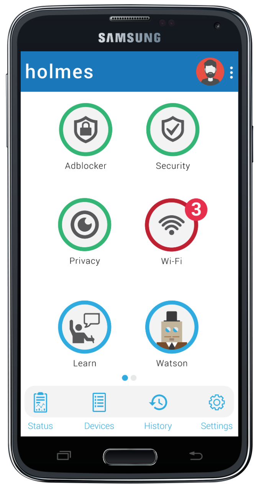

# Voorlichting Vechtdal College

## Herman Slatman

#### 5 september 2018

---

# Personalia

<ul>
    <li class="fragment">
        Herman Slatman
    </li>
    <li class="fragment">
        27
    </li>
    <li class="fragment">
        2003 - 2009 @ Vechtdal College
    </li>
    <li class="fragment">
        Natuur & Techniek
    </li>
    <li class="fragment">
        VWO eXtra (Gymnasium)
    </li>
</ul>

---

# Studie

<ul>
    <li class="fragment">
        Universiteit Twente
    </li>
    <li class="fragment">
        Technische Natuurkunde
        <ul class="fragment">
            <li>
                Propedeuse
            </li>
        </ul>
    </li>
    <li class="fragment">
        Bachelor Technische Informatica 
    </li>
    <li class="fragment">
        Master Computer Science
        <ul>
            <li class="fragment">
                Specialisatie in Computer Security
            </li>
            <li class="fragment">
                Afstudeerstage @ Deloitte Amsterdam
            </li>
            <li class="fragment">
                Afgemaakt binnen de UT
            </li>
        </ul>
    </li>
</ul>

---

# Werk

<ul>
    <li class="fragment">
        Slatman IT
    </li>
    <li class="fragment">
        Extendas
        <ul>
            <li class="fragment">
                Software ontwikkelaar
            </li>
            <li class="fragment">
                Software architect
            </li>
        </ul>
    </li>
    <li class="fragment">
        DistributIT
        <ul>
            <li class="fragment">
                Opgericht met Berry Gerrits
            </li>
            <li class="fragment">
                Ontwikkeling van <a href="https://holmes.distributit.nl/" target="_blank">veilige thuisrouter</a>
            </li>
        </ul>
    </li>
</ul>

